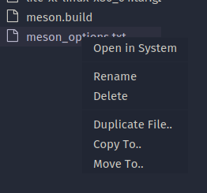

# Lite XL Treeview Extender
Additional file operation menu for Lite XL's treeview. This plugin add file operation menu to Lite XL's treeview.

## Installation
Clone this repo into your plugins folder, rename it to `treeview-extender` as save it in your plugins folder.

## Additional Menu
This plugin adds this menu to Lite XL :
- `Move To..` : Move a file or directory to another path
- `Duplicate File..` : Duplicate a file to the current directory
- `Copy To..` : Copy a file to destination path

## Screenshot

